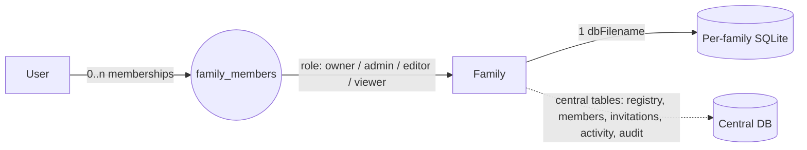
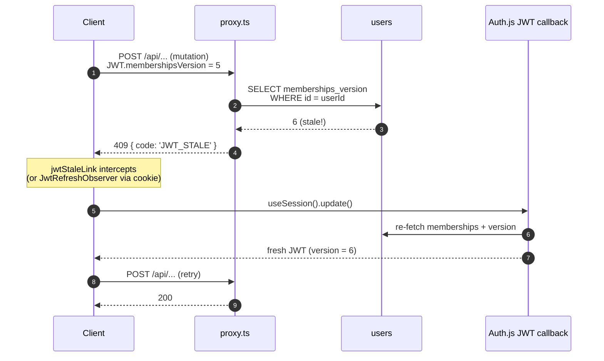
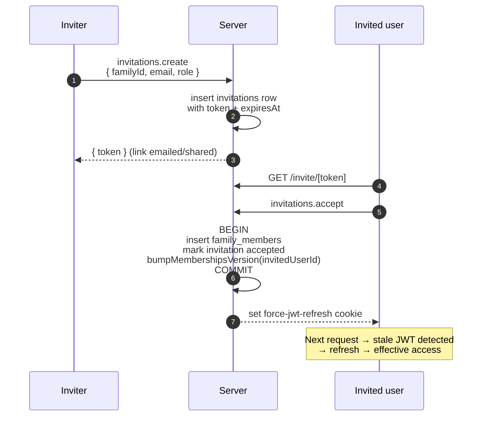

# RBAC & Family Spaces

A narrative guide to how Ancstra isolates data per family and gates actions by role. This is the *front-door* doc — start here, then drill into the design spec, ADRs, or source for depth.

- **Design history & decisions:** [`docs/rbac/architecture.md`](../rbac/architecture.md)
- **Shipping status (all six sub-specs done):** [`docs/RBAC_ROADMAP.md`](../RBAC_ROADMAP.md)
- **Schema reference:** [`docs/architecture/data-model.md`](data-model.md)

---

## The mental model in one diagram

Ancstra has two orthogonal axes of access:

- **Family space** — *which* genealogical data you can see. A family space is a row in `family_registry` plus its own dedicated SQLite database file.
- **Role** — *what* you can do with the data of a family space you belong to. One of `owner`, `admin`, `editor`, `viewer`.

The bridge between the two is a **membership** row in `family_members`.



A user with no membership row for a family has no path to that family's data. A user with a membership has access bounded by the role attached to that membership.

---

## Family spaces

### What a family is

A family is a row in `family_registry` (`packages/db/src/central-schema.ts:43-53`). It carries a name, the creator (`ownerId`), an isolated SQLite filename (`dbFilename`), and a few per-family knobs: `moderationEnabled`, `maxMembers`, `monthlyAiBudgetUsd`.

Every family gets its **own SQLite database file**. The factory is `createFamilyDb(dbFilename)` in `packages/db/src/index.ts:41`, and `FamilyDatabase` is the connection type. All persons, families (the partnership entity), events, sources, media, and proposed relationships for that family live in that file — and *only* that file.

### Why per-family DB isolation

Physical separation. A connection from `createFamilyDb('a.db')` literally points at a different file than `createFamilyDb('b.db')`. A query inside that connection cannot see family B's family-scoped tables — there's no cross-family JOIN to forget, no `WHERE familyId = ?` to leave off. This is the strongest invariant in the system.

The **central DB** (`getCentralDbSync()`) is a different story. It holds tables that *intentionally* span families: `users`, `family_registry`, `family_members`, `invitations`, `activity_feed`, `platform_audit_log`. Every central-DB query that touches a family-scoped table must include an explicit `WHERE family_id = ctx.familyId` (or equivalent join filter). The application is responsible for that — there's no physical wall.

### Membership = sole access grant

There is no global admin role and no shared-tree mode. The only way a user has any access to a family is via a row in `family_members (familyId, userId)`. Without that row, the L1 middleware (below) refuses to set `x-family-id` for that family — it returns 403.

The active membership picker uses `lastSeenAt DESC NULLS LAST, joinedAt DESC` (sub-spec D2), so the family you used most recently is the default after sign-in.

---

## Roles

### Four roles, three in the UI

The DB enum is `'owner' | 'admin' | 'editor' | 'viewer'` (`packages/auth/src/types.ts:1`). The role dropdown in invite + member-management UIs only surfaces the latter three — `owner` is set implicitly when a user creates a family, and it's transferred via a dedicated UX flow (not a role change).

The full permission matrix lives in `packages/auth/src/permissions.ts:19-39`. The distinguishing perms — what each tier *adds* over the one below — are:

| Role     | Adds                                                                                          |
|----------|-----------------------------------------------------------------------------------------------|
| `viewer` | `tree:view`, `activity:view`                                                                  |
| `editor` | persons / families / events / sources CRUD (no delete), `media:upload`, `gedcom:export`, `ai:research`, `relationship:validate` |
| `admin`  | `*:delete`, `gedcom:import`, `media:delete`, `members:manage`, `members:invite`, `contributions:review` |
| `owner`  | `tree:delete`, `settings:manage`, `members:transfer-ownership`                                |

Read the full matrix when you need it; the source is short.

### The single-owner invariant

Exactly one `owner` per family. This is **DB-enforced**, not application-enforced — a partial unique index:

```sql
CREATE UNIQUE INDEX IF NOT EXISTS uq_family_members_family_owner
  ON family_members (family_id) WHERE role = 'owner';
```

Created idempotently by `ensureCentralSchema()` in `packages/db/src/index.ts:270-271`. A second insert of `role='owner'` for the same family fails at the driver level — surfaced as `ConcurrentTransferError` and returned to clients as `409 { code: 'CONCURRENT_TRANSFER' }`.

Ownership transfer is therefore a single transaction (`BEGIN/COMMIT/ROLLBACK`, raw SQL for driver-agnostic atomicity across better-sqlite3 and libsql) that demotes the current owner to `admin`, promotes the target `admin` to `owner`, bumps both users' `memberships_version`, and writes an `activity_feed` entry. See [ADR-017](decisions/017-rbac-share-invite-ux.md) for the design.

---

## Enforcement layers (defense-in-depth, fail-closed)

```mermaid
flowchart TB
  Req[Incoming request] --> L1
  L1[L1 — proxy.ts<br/>Strip x-family-* headers · Resolve active family · 409 if JWT stale] --> L2
  L1 --> L3
  L2[L2 — withAuth&#40;permission&#41;<br/>Legacy route handlers · Re-derives role from JWT · throws ForbiddenError] --> Handler[Route handler]
  L3[L3 — protectedProcedure&#40;permission&#41;<br/>tRPC · .meta&#40;&#123; permission &#125;&#41; · TRPCError FORBIDDEN] --> Procedure[tRPC procedure]
  Handler -. "rendered in" .-> RSC[RSC / page]
  Procedure -. "rendered in" .-> RSC
  RSC --> L4[L4 — RoleGate / useHasPermission<br/>UX-only affordance hiding · NEVER the security boundary]
```



### L1 — proxy.ts (Next.js middleware)

`apps/web/proxy.ts` runs on every request. It:

- Strips any inbound `x-user-*` / `x-family-*` headers — clients cannot inject identity.
- Resolves the active family from `?family=` → cookie → `lastSeenAt`-ranked memberships.
- Verifies `activeFamilyId ∈ JWT.memberships`; 403 otherwise.
- Sets `x-user-id`, `x-family-id`, `x-family-db` for downstream handlers (these are *trusted hints* because the middleware set them; clients can't forge them).
- **Does not set `x-family-role` anymore.** Role is always re-derived in L2/L3 from JWT.
- Detects stale JWTs: if `JWT.membershipsVersion < users.memberships_version`, blocks mutating requests with `409 { code: 'JWT_STALE' }`. The client refreshes and retries.

See [ADR-014](decisions/014-rbac-enforcement-hardening.md) for the security teeth.

### L2 — `withAuth(permission)` (legacy route handlers)

`apps/web/lib/auth/api-guard.ts:22` wraps `/api/*` route handlers. It calls `requireAuthContext()` to re-derive `{ userId, familyId, role, dbFilename }` from the JWT (never headers), runs `requirePermission(role, permission)` from `@ancstra/auth`, and returns `{ ctx, familyDb, centralDb }`. Failures throw `ForbiddenError`, which `handleAuthError()` maps to 403.

This layer remains for legitimate route-handler use cases that don't migrate cleanly to tRPC: file uploads, NextAuth callbacks, AI streaming responses, webhooks.

### L3 — `protectedProcedure(permission)` (tRPC)

The substrate for all new mutations. Procedures declare permissions *as metadata*:

```ts
export const personRouter = router({
  delete: protectedProcedure
    .meta({ permission: 'person:delete' })
    .input(z.object({ id: z.string() }))
    .mutation(async ({ ctx, input }) => { /* ... */ }),
});
```

The check happens in `apps/web/server/api/middleware/permission.ts:5-20` — declarative, central, impossible to forget on a procedure that opts into it. Procedure flavors live in `apps/web/server/api/init.ts`: `publicProcedure`, `authenticatedProcedure`, `protectedProcedure`, `platformAdminProcedure`. The first three correspond to deepening trust requirements; the fourth is the cross-family super-admin lane (independent of family-scoped roles, gated on `users.is_platform_admin`).

See [ADR-013](decisions/013-trpc-as-action-substrate.md) for why tRPC and how it replaced the seven legacy server actions.

### L4 — `<RoleGate>` and `useHasPermission` (client UX)

`apps/web/components/auth/role-gate.tsx` and `apps/web/lib/auth/use-has-permission.ts`. Used to hide affordances a user can't act on (e.g. don't show a "Delete person" button to a viewer).

```tsx
<RoleGate permission="person:delete">
  <DeletePersonButton id={person.id} />
</RoleGate>
```

**Always belt-and-braces.** The server still enforces via 403/409. L4 is purely UX: if a stale or buggy client somehow shows a forbidden button, clicking it still fails on the server. See [ADR-015](decisions/015-rbac-client-foundation.md) and [ADR-016](decisions/016-rbac-d2-ux-layer.md) for the client foundation.

---

## JWT contract and `memberships_version`

The session strategy is JWT (see `apps/web/auth.ts:67`). The shape after the `jwt` callback (`apps/web/auth.ts:70-122`) is:

```ts
{
  userId: string;
  memberships: Array<{ familyId: string; role: Role; dbFilename: string }>;
  membershipsVersion: number;  // mirror of users.memberships_version at JWT issue time
  isPlatformAdmin: boolean;
}
```

**Role is always re-derived per request from `JWT.memberships[familyId]`.** Headers are never the source of truth. This is the fix for the original header-forgery escalation: no client-supplied or middleware-set `x-family-role` exists anywhere in the codebase post sub-spec A.

### How stale JWTs are caught

`users.memberships_version` (`packages/db/src/central-schema.ts:11`) is bumped on any membership change: invite accepted, role changed, ownership transferred, member removed, family deleted. The proxy compares the JWT's snapshot against the live column on each request:



The client side of the loop — `<JwtRefreshObserver>`, `jwtStaleLink`, the `runRefresh` debounce module — coalesces concurrent triggers into a single in-flight refresh and emits one toast. Detail in [ADR-015](decisions/015-rbac-client-foundation.md) and [ADR-016](decisions/016-rbac-d2-ux-layer.md).

---

## Lifecycle: invite → accept → effective access



A few details worth knowing:

- The `invitations.role` enum is `'admin' | 'editor' | 'viewer'` (`packages/db/src/central-schema.ts:77`) — owner is never invitable.
- A non-owner inviter can't pick `admin` (UX hides it; the server enforces).
- `bumpMembershipsVersion` is called inside the same transaction as the membership insert, so the next request from the invited user is guaranteed to detect staleness and refresh.

The same pattern (mutate + bump) applies to role change, member removal, ownership transfer, and family deletion. Five sites in total — they're enumerated in [`docs/RBAC_ROADMAP.md`](../RBAC_ROADMAP.md) under sub-spec A.

---

## Cross-cutting interactions

### Proposed relationships pipeline

AI tools, GEDCOM imports (for non-trusted sources), and record-matching never modify the family tree directly. They write to `proposed_relationships` (`packages/db/src/ai-schema.ts:22-47`) with `status='pending'`. The schema enumerates the `sourceType`: `familysearch | nara | ai_suggestion | record_match | ocr_extraction | user_proposal`.

The AI tool implementation (`packages/ai/src/tools/propose-relationship.ts:17-89`) explicitly never touches `families` or `children`. The tool description ends with: *"Creates a pending proposal for editor validation — does NOT directly modify the family tree."*

Confirmation requires `relationship:validate` — held by `editor`, `admin`, `owner` (not `viewer`). The validation layer is in `@ancstra/research`; from an RBAC standpoint, the only fact you need is *who can confirm a proposal*: editor and above.

### Living-person filter

`isPresumablyLiving()` runs on all read paths. An entity is "presumed living" if `is_living=false` is not explicitly set, no death date exists, and the birth date is within the last 100 years. The filter then redacts based on context — and **role is part of that context**:

| Context              | Person          | Events                | Media     | Relationships           |
|----------------------|-----------------|-----------------------|-----------|-------------------------|
| owner / admin (API)  | full            | full                  | full      | full                    |
| editor (API)         | full name       | full, descriptions stripped for living | full | full names      |
| viewer (API)         | "Living"        | birth year + country  | hidden    | count only ("2 children") |
| export (shareable)   | "Living"        | birth year only       | excluded  | count only              |
| AI context           | "Living" for living, full for deceased | birth year for living | never sent | IDs only for living |

Source: [ADR-009](decisions/009-living-person-filter.md) and `docs/architecture/patterns/filter-for-privacy.ts`. The filter is applied at the service/query layer, not at the component layer — every access path must apply it; there is no "raw" mode for client code.

---

## Quick-start: adding a permission-checked feature

The common case is *new tRPC mutation, new UI affordance*. Three small steps:

1. **Pick or add the permission.** Most domain operations already have a permission. If you need a new one, add it to the `Permission` union in `packages/auth/src/types.ts:13-26` and to the appropriate role(s) in `packages/auth/src/permissions.ts:19-39`. Update the matrix tests in `packages/auth/__tests__/permissions-matrix.test.ts`.

2. **Declare it on the procedure.**

    ```ts
    export const personRouter = router({
      archive: protectedProcedure
        .meta({ permission: 'person:edit' })
        .input(z.object({ id: z.string() }))
        .mutation(async ({ ctx, input }) => {
          // ctx.role, ctx.userId, ctx.familyId, ctx.familyDb already populated
        }),
    });
    ```

3. **Gate the affordance on the client.**

    ```tsx
    <RoleGate permission="person:edit">
      <ArchivePersonButton id={person.id} />
    </RoleGate>
    ```

That's it. L1 (proxy) handles family scoping, L3 (permission middleware) enforces the perm, L4 (RoleGate) hides the button. If you're writing a legacy route handler instead of a procedure, replace step 2 with `const { ctx, familyDb } = await withAuth('person:edit', request);`.

---

## Where to go for more

| You want…                              | Look at                                                                  |
|----------------------------------------|--------------------------------------------------------------------------|
| Original design + decisions D1–D6      | [`docs/rbac/architecture.md`](../rbac/architecture.md)                  |
| Status of every sub-spec, file map     | [`docs/RBAC_ROADMAP.md`](../RBAC_ROADMAP.md)                             |
| Schema reference (every table)         | [`docs/architecture/data-model.md`](data-model.md)                       |
| Why CSRF + auth on routes (pre-roadmap)| [ADR-008](decisions/008-rbac-middleware.md)                              |
| Why tRPC                               | [ADR-013](decisions/013-trpc-as-action-substrate.md)                     |
| Header trust, JWT staleness, owner UQ  | [ADR-014](decisions/014-rbac-enforcement-hardening.md)                   |
| Client SessionProvider, RoleGate       | [ADR-015](decisions/015-rbac-client-foundation.md)                       |
| Family switcher, lastSeenAt, adoption  | [ADR-016](decisions/016-rbac-d2-ux-layer.md)                             |
| Transfer-ownership atomicity, share UX | [ADR-017](decisions/017-rbac-share-invite-ux.md)                         |
| Living-person filter                   | [ADR-009](decisions/009-living-person-filter.md)                         |
| Sub-spec design + plan docs            | [`docs/rbac/`](../rbac/) (`a-hardening`, `b-trpc-migration`, `c-share-invite`, `d1-foundation`, `e-audit-tests-docs`) |

---

*Diagrams use Mermaid; other architecture docs in this repo use ASCII boxes. This was a deliberate choice for legibility on this doc — not a house-style change.*
